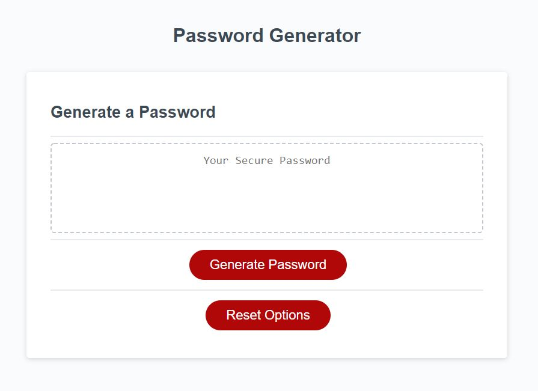
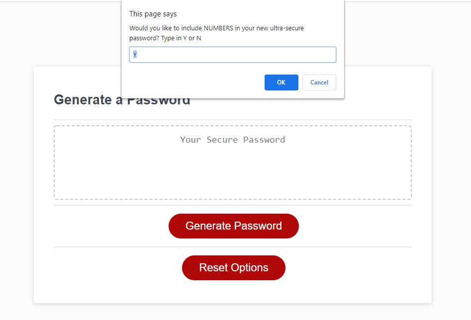
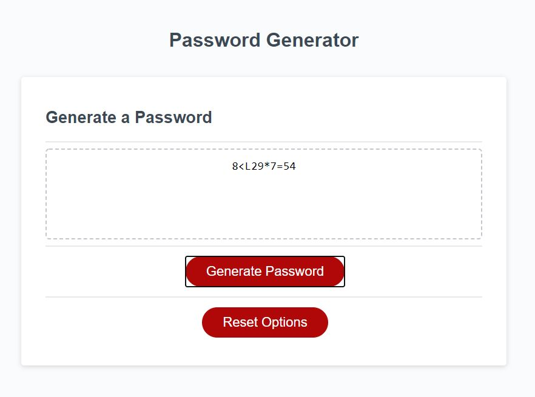

# Llanes-Password-Generator

## The Importance of Passwords

Passwords are more important than most people realize. Having a password such as "password" or "12345" can be extremely devestaing to security. At the same time, having a password based on your kid's names, or your pet's name, or even a birth date of someone in your family can be just as unsecure. We use these types of passwords because they are easier to remember, but at the same time it makes the password easier to be "cracked" by someone trying to get to your information.

## Proper/Secure Passwords

It is becoming more common practice for systems to require passwords to be more "difficult." The systems do this by requiring certain criteria. For example, the system may require you to have a password with a minimun length of characters. A password that only has four characters in it does not have as many combinations as a password with ten characters, therefore it will be easier to guess. If a password only uses numbers or only alphabet letters (a-z), then once again combinations are limited and the potential for an outsider to guess/crack the password is greater. However, by requiring the user to have a set minimum requirement for a password, this can increase the difficulty of the password being guessed.
Examples of requirements:

- Password must require at least one number in it.
- Password must require at least one special character in it.
  - Examples ` ~ ! @ # $ % ^ & \* ( ) - \_ + = < > ? / \ [ ] { } | : : , .
- Password must require at least one lower case letter.
- Password must require at least one upper case letter.
- Password must require a minimum of 10 characters.
- Good Common Practice: User must change their password every X amount of days.

This may seem like a lot to take into consideration, but that is the whole point. It will make your password more secure against those trying to guess it.

## Password Generator

The most secure type of password you can get is one that is truely random, where even the user has no idea how the password was created. By using a password generator you can get a password such as "94sC[4|Zc,{t" which might be difficult to remember, but it will also be nearly impossible for someone to crack.

The Llanes Password Generator will help you create a password that will definately be reliable and secure. Although 100% security is never a guarantee, this is as close as you can get to it.

See the following images to get an idea of what the Llanes Password Generator looks like:

For more information, please contact Michael Llanes via e-mail: llanesm@gmail.com
